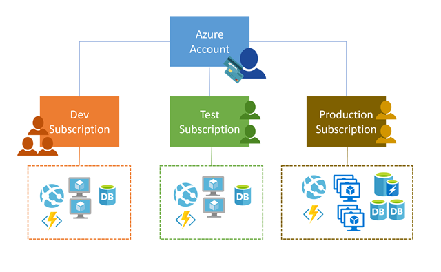

# Azure

## Compute

1. Virtual Machines
2. Containers
3. Azure App Service
4. Serverless computing

## Storage

* Azure SQL Database - relational
* Azure Cosmos DB - schemaless
* Azure Blob storage
* Azure Data lake storage
* Azure Files - SMB Protocol
* Azure Queue - Messages
* Disk Storage - disks for virtual machines
* Storage Tiers
    * Hot storage
    * Cold storage - infrequent access stored for at least 30 days
    * Archive storage - rarely accessed stored for at least 180 days with flexible latency requirements
* Encryption and replication
    * Azure Storage Service Encryption (SSE)
    * Client-side encryption

## Networking
* Azure Virtual Network
* Peering
* Network Security Group (NSG)
* Azure Traffic Manager - route to nearest server farm

## Subscriptions

Create multiple subscriptions in a single account
access control and billing at the subscription level

Hard limitations. 
e.g. Hard limit of 10 Express Routes per subscription
